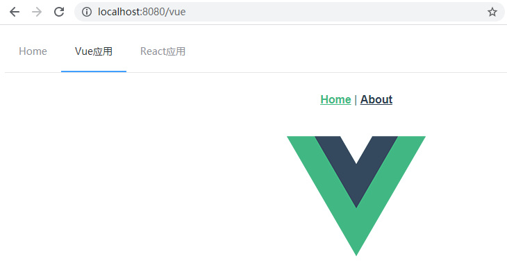

效果展示：





### 拉取仓库使用说明：

由于仓库含有子仓库，所以直接拉取会得到空文件夹，请按照如下方法拉取：

```
git clone https://github.com/furfur-jiang/qiankun_test.git

cd qiankun_test

git submodule init

git submodule update
```

这样可以拉取主仓库和子仓库的全部内容。

拆分出主仓库和子仓库也是为了更符合实际开发需求。


### 使用说明：

子仓库需要跑起来，主仓库调用的时候才不会报错

vue项目：npm run dev

react项目: npm run start


备注：

配套qiankun学习视频资源来源B站，若未能搜到

关注程序江，回复qiankun即可领取


